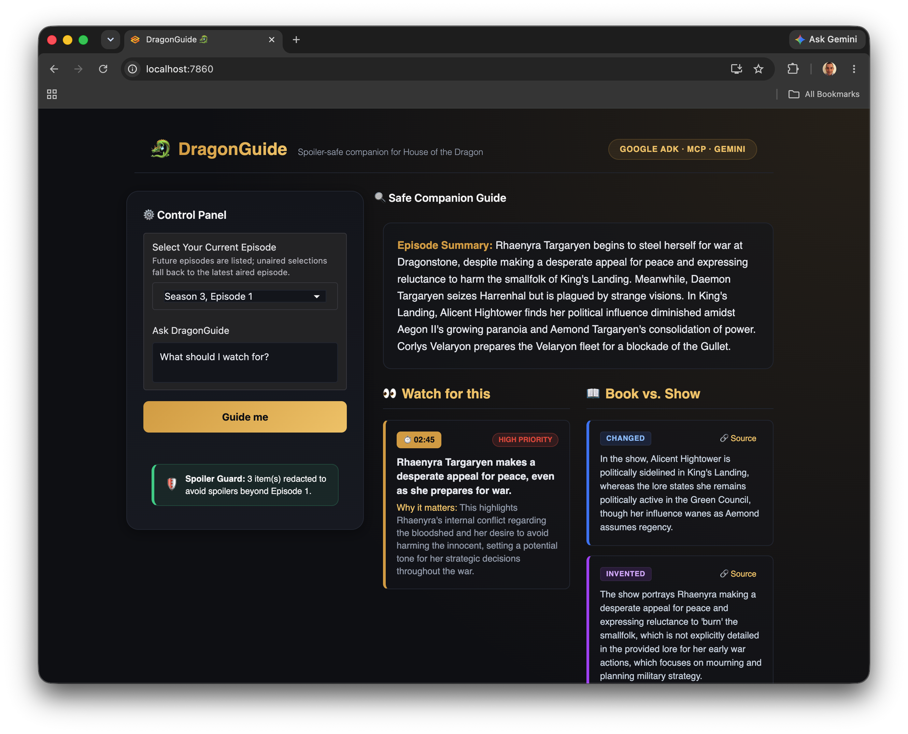

# 🐉 DragonGuide



**A spoiler-aware, multi-agent companion for HBO's *House of the Dragon* Season 3.**

DragonGuide tells you exactly what to watch for in the episode you're about to see — and nothing you shouldn't see yet. For any episode, it produces a concise summary, **timestamped "watch-for-this" callouts** of plot-critical moments, and a **"book vs. show — what changed"** brief drawn from George R.R. Martin's *Fire & Blood*. A spoiler-guardrail layer ensures you never see content beyond the episode you're on.

> Built for the Kaggle × Google **5-Day AI Agents Intensive (Vibe Coding)** Capstone — Freestyle track.
> Repo description & topics: see [.github/REPO_METADATA.md](.github/REPO_METADATA.md).

---

## The problem

*House of the Dragon* has a dense, multi-timeline plot and diverges meaningfully from its source material. Casual viewers miss foreshadowing, forget who's who, and lose the thread across episodes. The fix — online recaps — are landmine fields of spoilers. There's no tool that gives a viewer **just-in-time, spoiler-safe context** for the episode in front of them.

## The solution

DragonGuide is a **Google ADK multi-agent system** that ingests **official HBO YouTube content** (Sneak Peek, *Inside the Episode*, the official podcast) and cross-references **A Wiki of Ice and Fire / *Fire & Blood***, then routes everything through a **spoiler guardrail** bound to the user's current episode. Output is structured, source-linked, and rendered in a simple chat UI.

```mermaid
flowchart TD
    U(["Viewer: I'm on Episode N"]):::user

    subgraph UI[Gradio Chat UI]
      U --> APP[app.py]
    end

    APP --> RC

    subgraph ADK[Google ADK Multi-Agent System]
      RC[RootCoordinator<br/>LlmAgent<br/>owns spoiler boundary]:::coord
      RC --> PIPE

      subgraph PIPE[EpisodePipeline — SequentialAgent]
        direction TB
        T[TranscriptionAgent<br/>LlmAgent]:::agent
        L[LoreResearchAgent<br/>LlmAgent]:::agent
        D[AdaptationDiffAgent<br/>LlmAgent]:::agent
        H[HighlightAgent<br/>LlmAgent]:::agent
        S[SpoilerGuardAgent<br/>security gate]:::guard
        T --> L --> D --> H --> S
      end
    end

    subgraph MCP[MCP Server — mcp_server/server.py]
      Y[[fetch_youtube_transcript]]:::tool
      V[[search_official_hotd_videos]]:::tool
      W[[lookup_lore]]:::tool
    end

    T -. McpToolset .-> Y
    T -. McpToolset .-> V
    L -. McpToolset .-> W

    Y --> YT[(Official HBO YouTube<br/>captions — text only)]:::ext
    V --> CFG[(data/official_videos.json)]:::ext
    W --> WIKI[(A Wiki of Ice and Fire /<br/>Fire & Blood — summarized + linked)]:::ext

    S --> OUT[/Structured, spoiler-safe output<br/>summary · watch_for[] · book_vs_show[] · sources[]/]:::out
    OUT --> APP

    GR{{guardrails.py<br/>spoiler callback +<br/>input-safety}}:::guard
    GR -.enforces.- PIPE

    classDef user fill:#1f2937,stroke:#9ca3af,color:#fff;
    classDef coord fill:#7c2d12,stroke:#fb923c,color:#fff;
    classDef agent fill:#312e81,stroke:#818cf8,color:#fff;
    classDef guard fill:#7f1d1d,stroke:#f87171,color:#fff;
    classDef tool fill:#064e3b,stroke:#34d399,color:#fff;
    classDef ext fill:#1e293b,stroke:#64748b,color:#cbd5e1;
    classDef out fill:#374151,stroke:#9ca3af,color:#fff;
```

## Course concepts demonstrated (judge quick-reference)

| Key concept | Where it lives in this repo |
|---|---|
| **Multi-agent system (ADK)** | `src/dragonguide/coordinator.py` + `src/dragonguide/agents/*` |
| **MCP Server** | `mcp_server/server.py` (3 tools), consumed via `McpToolset` in agents |
| **Security features** | `src/dragonguide/guardrails.py` + `tests/test_spoiler_guard.py` (proves no future-episode leakage; secret hygiene via `.env`) |
| **Deployability** | `Dockerfile` + reproducible local run below |
| **Agent skill / CLI** | `python -m dragonguide --episode N` (see [__main__.py](src/dragonguide/__main__.py)) |

We demonstrate **5** of the required minimum **3** concepts.

---

## Architecture

See **[ARCHITECTURE.md](./ARCHITECTURE.md)** for the full diagram and data flow. In brief:

- **RootCoordinator** (`LlmAgent`) — owns the spoiler boundary, routes the request.
- **EpisodePipeline** (`SequentialAgent`) — deterministic 5-stage pipeline:
  1. **TranscriptionAgent** — fetches official HBO YouTube captions via MCP (text only, never re-hosts media).
  2. **LoreResearchAgent** — looks up canonical *Fire & Blood* events via MCP, with source links.
  3. **AdaptationDiffAgent** — flags invented / changed / omitted beats (book vs. show).
  4. **HighlightAgent** — emits summary + timestamped, source-linked "watch-for-this" callouts.
  5. **SpoilerGuardAgent** — final security gate; strips anything past the current episode and reports what was redacted.

**Design invariants:** every fact carries a source link; the spoiler boundary never leaks.

---

## Quickstart

> Runs **fully offline** against cached fixtures by default, so it works with no API keys for evaluation. Add keys to enable live fetching.

### 1. Prerequisites
- Python 3.11+
- (Optional) A Gemini API key for live model calls; (optional) a YouTube Data API key for live transcript fetch.

### 2. Setup
```bash
git clone https://github.com/<your-username>/dragonguide.git
cd dragonguide
python -m venv .venv && source .venv/bin/activate
pip install -e ".[dev]"      # or: uv pip install -e ".[dev]"
cp .env.example .env        # then fill in keys if you want live mode (optional)
```

### 3. Run the MCP server (separate terminal — optional; the app launches it automatically)
```bash
python mcp_server/server.py
```

### 4. Launch the app
> [!NOTE]
> The test suite, CLI, and interactive Gradio UI all run fully offline against cached fixtures by default (no keys needed). Without API keys, the app runs a deterministic offline pipeline against fixtures to return rich structured guides. Adding a `GEMINI_API_KEY` to `.env` is optional and enables live model reasoning.

```bash
python app.py
# open the printed local URL, pick your episode, and ask away
```

### 5. Run the tests (proves the spoiler guardrail + offline pipeline)
```bash
pytest -v
```

### 6. Run the CLI tool
You can run the multi-agent companion directly from your terminal:
```bash
python -m dragonguide --episode 1 --message "What details should I pay attention to?"
```
Or, if you installed the package in editable mode:
```bash
dragonguide --episode 1
```
Unaired selection fallback is fully supported (selections beyond aired episodes will fallback to Episode 2 and display a warning).

### Docker (deployability)

Build the image locally:
```bash
docker build -t dragonguide .
```

Run the container (runs **fully offline** by default using cached fixtures, mapping port 7860):
```bash
docker run -p 7860:7860 dragonguide
```

To run with live API keys using your local `.env` configuration:
```bash
docker run -p 7860:7860 --env-file .env dragonguide
```
Once started, navigate to `http://localhost:7860` in your web browser to access the companion.

### Continuous Integration
Continuous Integration is configured to run tests and secret scanning automatically on every commit. See [.github/workflows/ci.yml](.github/workflows/ci.yml) for details.

---

## Fixture / Simulation Mode (and why)

To ensure the highest reliability and allow immediate evaluation without incurring cloud costs or token usage, DragonGuide features a complete, high-fidelity offline execution mode:

- **100% Offline Simulation:** When no live keys are set, or when `DRAGONGUIDE_OFFLINE=1` is configured, the system bypasses live Gemini calls entirely and serves pre-compiled, high-fidelity guides built directly from the local fixtures (`data/fixtures/transcripts.json` and `data/fixtures/lore.json`). This ensures the demo and safety checks are immediately reproducible for judges with zero setup cost.
- **Empty-URL Placeholder Strategy:** In `data/official_videos.json`, the `url` fields for some episodes are intentionally left as empty strings. HBO's official promotional content (like *Inside the Episode*, *Sneak Peek*, and the official podcast) are published week-by-week as the season airs, meaning some real URLs do not yet exist at submission time. The pipeline detects these empty strings and automatically simulates their transcripts using high-fidelity local fixtures.
- **Going Live:** When you are ready to use live data:
  1. Paste real per-episode promotional URLs into `data/official_videos.json` and set `"verified": true`.
  2. Set a valid `YOUTUBE_API_KEY` in `.env` to fetch live YouTube captions on-the-fly.
  No code changes are required; the pipeline automatically transitions from simulated fixtures to live API fetching once valid URLs are supplied.
- **Sourcing & Copyright Posture:** DragonGuide respects copyrights by design:
  - We only ingest **public promotional caption text** (not copyrighted video/audio).
  - Main show content remains strictly behind Max's paywall.
  - Lore lookup summaries are linked to A Wiki of Ice and Fire / *Fire & Blood* rather than verbatim copied.
  - Fixtures serve as a copyright-safe stand-in for immediate local evaluation.

---

## Configuration

| Env var | Required | Purpose |
|---|---|---|
| `GEMINI_API_KEY` | Live mode only | Gemini model access via ADK |
| `GEMINI_MODEL` | No | Override model (default: a Gemini flash model) |
| `YOUTUBE_API_KEY` | No | Live transcript/video lookup; falls back to fixtures |
| `DRAGONGUIDE_OFFLINE` | No | Force fixture mode (`1` = offline) |

**Security note:** All credentials live strictly in `.env` (which is copied from `.env.example` and git-ignored). To prevent accidental leaks of credential variants (such as `.env.gemini` or `.env.local`), all `.env.*` files are blocked in `.gitignore`. A built-in scanner is provided and should be run pre-commit to check for exposed secrets:
```bash
python scripts/secret_scanner.py
```
Fetched transcript text is treated as untrusted data and never executed as instructions (prompt-injection mitigation — see comments in `guardrails.py`).

---

## Data & sourcing ethics

- We fetch **caption text only** from official HBO YouTube videos and **link** to sources — we never download or re-host copyrighted audio/video.
- Lore lookups **summarize and link** to A Wiki of Ice and Fire / *Fire & Blood*; no bulk verbatim copying.
- `data/official_videos.json` curates the canonical official video URLs per episode for reproducibility.

## Limitations & future work
- **Dynamic Episode Configuration:** The episode dropdown lists projected episodes up to `SEASON_EPISODES` (default: 8). Currently, only 2 episodes have aired (`AIRED_EPISODES`). If a user selects a future, unaired episode, the application gracefully falls back to the latest aired episode (Episode 2) and restricts all spoiler boundaries accordingly. Both are configurable via environment variables (`DRAGONGUIDE_AIRED_EPISODES` and `DRAGONGUIDE_SEASON_EPISODES`).
- Future: per-episode character relationship graph, auto-generated "previously, and watch for…" cards, season-long divergence tracker.

## License
MIT. *House of the Dragon* and *Fire & Blood* are property of their respective rights holders; this is a non-commercial fan/educational project.
